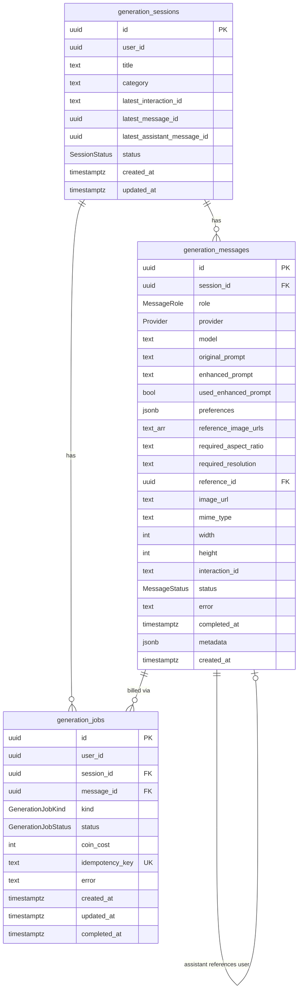
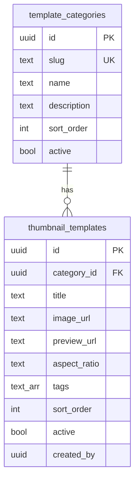

# Generation Worker — Database Visualization

Schema source: [`schema.prisma`](./schema.prisma) · Database: `generation_db`

Chat-style **messages** + **`generation_jobs`** as the wallet `jobId` for charges.

---

## Entity relationship



---

## Role contract (messages)

| Field | `role = user` | `role = assistant` |
|--------|----------------|---------------------|
| `provider` / `model` | per turn | per turn |
| `original_prompt` | required | null |
| `enhanced_prompt` | optional result text | null |
| `used_enhanced_prompt` | label if enhance was used | `false` |
| `preferences` | wizard filters | `{}` |
| `reference_image_urls` | user refs | `[]` |
| `required_aspect_ratio` / `required_resolution` | user selection | null |
| `reference_id` | null | → user message |
| `image_url` + meta | null | generated S3 image |
| `interaction_id` | null | Gemini turn id |
| `status` / `error` / `completed_at` | unused | image job lifecycle |

**Wallet `jobId` is never the message id** — use `generation_jobs.id`.

---

## Jobs (wallet bridge)

| `kind` | Linked `message_id` | Purpose |
|--------|---------------------|---------|
| `prompt_enhance` | user message | Enhance-prompt module charge |
| `generation` | assistant message | Image generation charge |

```
Client Idempotency-Key
        ↓
generation_jobs.id  ───►  wallet reserve / capture / release (jobId)
        │
        ├── kind=prompt_enhance → user message (enhanced_prompt, used_enhanced_prompt=true)
        └── kind=generation     → assistant message (image_url, …)
```

Job status: `created` → `reserved` → `processing` → `captured` | `released` | `failed`

---

## Hierarchy view

```
generation_sessions          (no provider/model — per message only)
│
├── latest_message_id
├── latest_assistant_message_id
├── latest_interaction_id
│
├── generation_messages[]
│     ├─ user: prompt, used_enhanced_prompt, aspect/resolution, …
│     └─ assistant: reference_id, image_url, interaction_id, status
│
└── generation_jobs[]        (id = wallet jobId, unique idempotency_key)
      ├─ prompt_enhance → user message
      └─ generation → assistant message
```

---

## Flow over time

```
Session
  │
  ├─ (optional) Job E  kind=prompt_enhance  → fills Msg1.enhanced_prompt
  │
  ├─ Msg 1  role=user   used_enhanced_prompt=true  aspect=16:9
  ├─ Msg 2  role=assistant  reference_id=1  status=queued
  ├─ Job G  kind=generation  message_id=2  id=<wallet jobId>
  │           reserve(G) → processing → image → capture(G)
  │           session.latest_* → Msg2 / interaction A
  │
  └─ refine… Msg3 user → Msg4 assistant → Job G2 …
```

---

## Tables

### `generation_sessions`

| Column | Type | Notes |
|--------|------|--------|
| `id` | UUID PK | |
| `user_id` | UUID | |
| `title` / `category` | TEXT? | |
| `latest_interaction_id` | TEXT? | Gemini head |
| `latest_message_id` | UUID? | Soft pointer |
| `latest_assistant_message_id` | UUID? | Soft pointer |
| `status` | `SessionStatus` | |
| `created_at` / `updated_at` | TIMESTAMPTZ | |

No `provider` / `model` on session — chosen per message.

---

### `generation_messages`

| Column | Type | Notes |
|--------|------|--------|
| `id` | UUID PK | Chat row only (not wallet jobId) |
| `session_id` | UUID FK | CASCADE |
| `role` | `MessageRole` | |
| `provider` / `model` | per turn | |
| `original_prompt` / `enhanced_prompt` | TEXT? | user |
| `used_enhanced_prompt` | BOOLEAN | user label |
| `preferences` | JSONB | user |
| `reference_image_urls` | TEXT[] | user |
| `required_aspect_ratio` / `required_resolution` | TEXT? | user |
| `reference_id` | UUID FK? | assistant → user |
| `image_url` + mime/width/height | | assistant |
| `interaction_id` | TEXT? | assistant |
| `status` / `error` / `completed_at` | | assistant |
| `metadata` / `created_at` | | |

---

### `generation_jobs`

| Column | Type | Notes |
|--------|------|--------|
| `id` | UUID PK | **Wallet `jobId`** |
| `user_id` | UUID | |
| `session_id` | UUID FK? | SET NULL |
| `message_id` | UUID FK? | assistant (generation) or user (enhance) |
| `kind` | `GenerationJobKind` | `generation` \| `prompt_enhance` |
| `status` | `GenerationJobStatus` | billing/queue lifecycle |
| `coin_cost` | INT | Authoritative charge amount |
| `idempotency_key` | TEXT UNIQUE | Client key |
| `error` / timestamps | | |

---

## Enums

```
SessionStatus         active | archived
MessageRole           user | assistant
MessageStatus         queued | processing | completed | failed
Provider              gemini | openai
GenerationJobKind     generation | prompt_enhance
GenerationJobStatus   created | reserved | processing | captured | released | failed
```

---

## Wallet integration (recommended)

| Step | Mechanism | Why |
|------|-----------|-----|
| **Quote** | Sync HTTP gateway → wallet | Need cost before UI confirm |
| **Reserve** | Sync HTTP before enqueue | Fail fast with 402; don’t queue unpaid work |
| **Capture** | Consumer on `generation.completed` | Worker already async; wallet reacts to event |
| **Release** | Consumer on `generation.failed` | Same; no generation→wallet HTTP on failure path |

Do **not** make the generation worker call wallet over HTTP for capture/release — publish events and let wallet consume with `idempotency_key = jobId`.

Enhance-prompt module: same pattern with `kind = prompt_enhance` and its own `generation_jobs.id` as wallet `jobId`.

---

## Relations summary

| From | To | On delete |
|------|-----|-----------|
| messages.session_id | sessions.id | CASCADE |
| messages.reference_id | messages.id | SET NULL |
| jobs.session_id | sessions.id | SET NULL |
| jobs.message_id | messages.id | SET NULL |
| templates.category_id | categories.id | CASCADE |

Session `latest_*` pointers are application-managed (not FKs).

---

## Template library (admin)

Catalog separate from chat history. Admin CRUD; users browse **active** templates by category.



### Selection flow

```
Library UI → user picks template(s)
           → copy template.image_url into message.reference_image_urls
           → store template.id in message.reference_template_ids (analytics)
           → NO live FK to template (history safe if admin archives later)
```

| Table | Purpose |
|-------|---------|
| `template_categories` | Sections (Gaming, Tech, …); unique `slug`; `active` + `sort_order` |
| `thumbnail_templates` | S3 `image_url` (+ optional `preview_url` for grid) |

**API sketch:** public `GET /api/templates?category=gaming`; admin create/update/deactivate gated by auth `admin` role. Upload to S3 on admin create, persist CDN URL.
